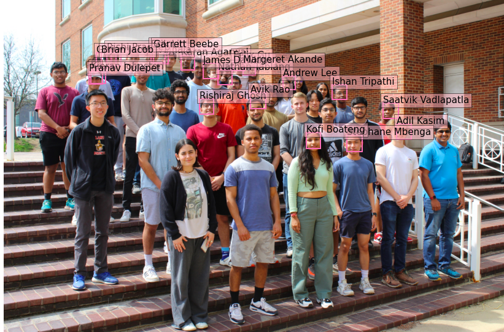
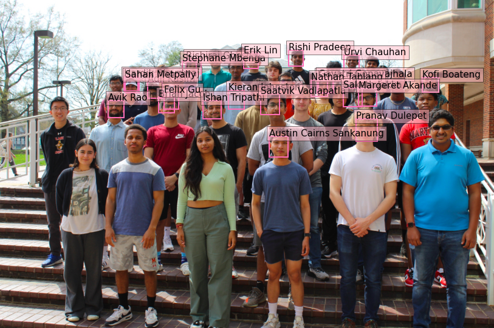

# 

# Face-Recognition-Model

<table>
<tr>
<td>
 This model utilizes a convolutional neural network for face detection using Facebook AI’s Detection Transformer. This model was trained and tested based on positive and negative samples provided by Microsoft’s COCO dataset. Created with Spencer Lutz, Rishi Pradeep, and Varun Jonnavithula through the First-Year Innovation & Research Experience (FIRE) program at the University of Maryland. 
</td>
</tr>
</table>

## Technologies

- 
- 
- 
- 
- 

# 
